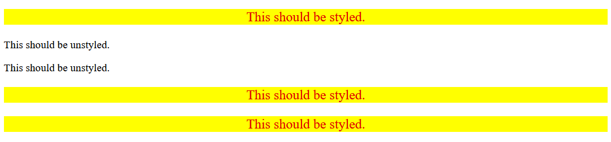

# Descendant Combinator
Understanding how combinators work can become a lot easier when you start playing around with them and see what exactly is affected by them versus what isn't.

The goal of this exercise is to apply styles to elements that are descendants of another element, while leaving elements that *aren't* descendants of that element unstyled.

You can use either type or class selectors for this exercise; use whichever you may feel you want to practice with more. The HTML file is set up (so no need to edit anything in it) such that any combination of selectors will work, so if you're feeling adventurous you can even try combining a type *and* class selector for the descendant combinator.

The properties you need to add are:

* Only the `p` elements that are descendants of the `div` element should have a yellow background, red text, a font size of 20px, and center aligned.

## Desired Outcome

### Self Check
- Do the elements that contain the text "This should be styled" have the correct styles applied?
yes sir!, i did by using/coding (.container p) this main na lahat ng p elements na nasa loob ng class container a maaapektohan ng code/styles na yun.

- Do the elements that contain the text "This should be unstyled" have no styles applied?
yep! they are not included or not affected by the style i code cause they are siblings and not descendant/under of the class container.

